# Usage examples

<a name="example1"></a>
## Example 1: processing an interval

In the first example, we will look just at the intervals on tier 3 labeled ```v``` (demarcating the vowel of interest in each file). In the **Run script: File info** dialog, set the path to the EGG files to be the location of the ```examples``` directory on your local machine. Set *intervalTier* to *3* and *intervalLabel* to *v*. Leave all other parameters in this and the following dialog box at their default values.

The first file to be processed is ```dhâlem_iso_1_mis.wav```. It is apparent from the Oq scatterplot that something is wrong:

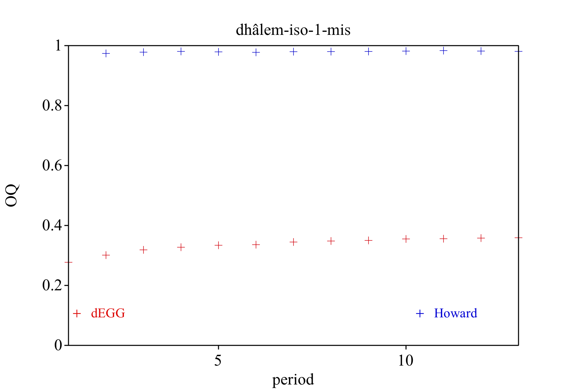

Inspection of the resulting PointProcess object reveals that this is because the pulse train begins with an opening, rather than a closing peak:

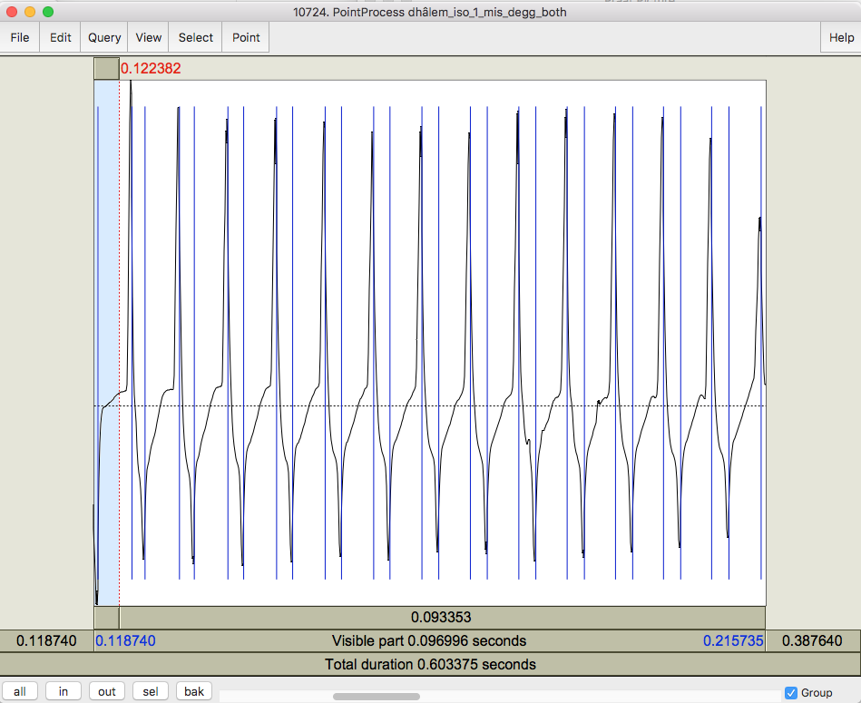

Two options are available: (1) remove the offending point or (2) edit the boundary in the TextGrid such that a closing peak is included. Here we will opt for (1), but note that this may [cause problems later](#example2).

The updated Oq plot looks much more reasonable:

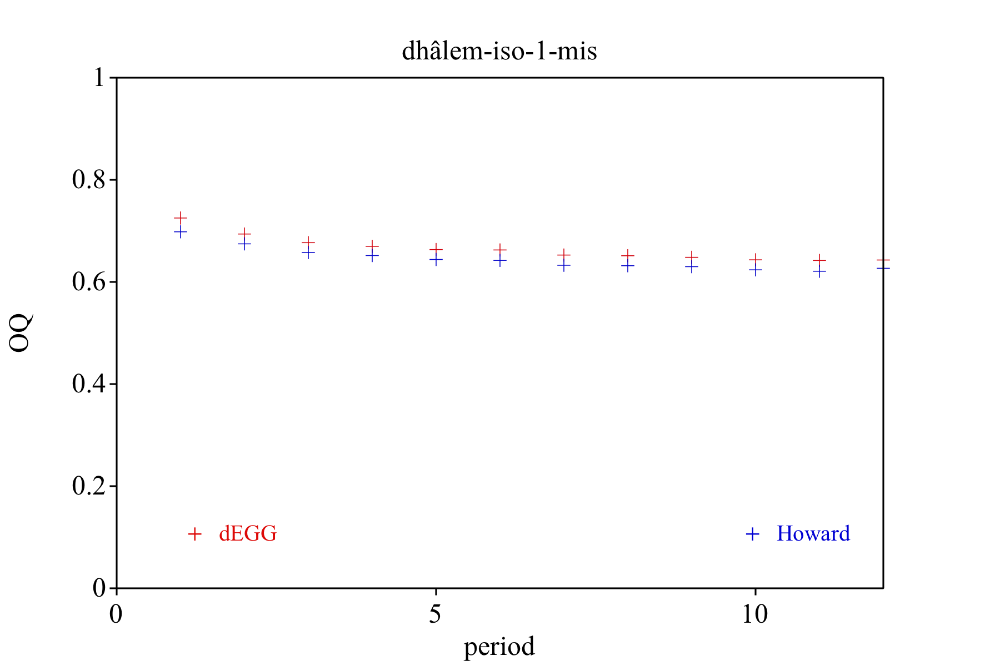

We can now enter ```0``` in the *Do you want to add/delete any points? (1=yes)* text box and click ```Continue```. Since all these points look reasonable, we can also leave the text box in the following dialog blank and click ```Continue``` again. This will save the modified PointProcess object, write the Oq values to the output text file, and load the next file in the ```examples``` directory.

Once again we can immediately see that there is a similar problem to the previous file:

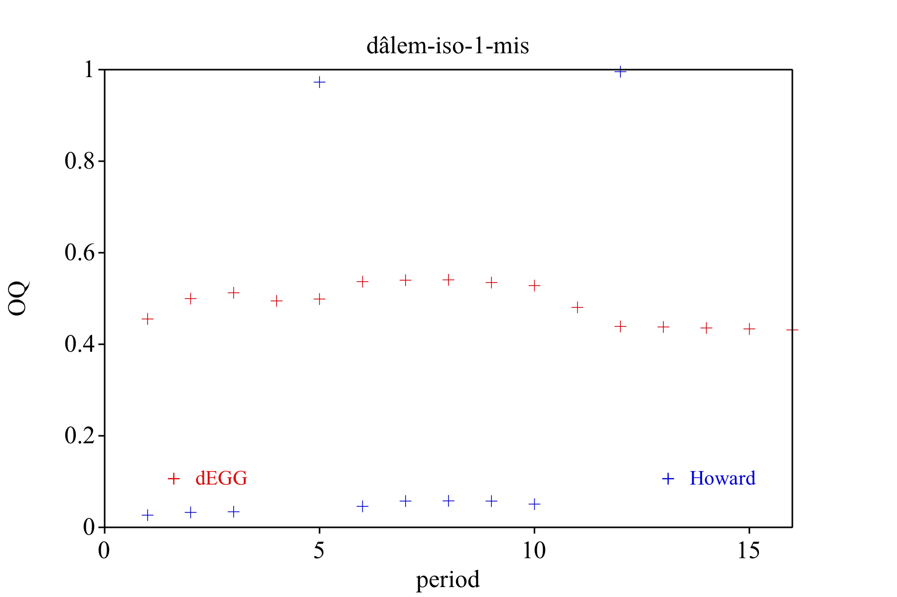

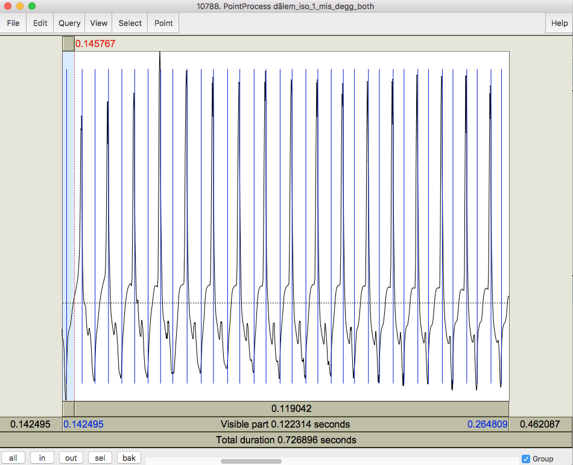

The Oq plots for the remaining files look OK. Note the (possible) multiple opening peaks in the above example.

<a name="example2"></a>
## Example 2: processing a file

Now, perhaps we decide that we are interested in Oq values for other parts of these files, not just those in the ```v``` region. Run ```oqmaster.praat``` again, but this time setting *intervalLabel* to be blank in the initial dialog. This will process the entire file, rather than just a specific region.

Once again, the first file to be processed is ```dhâlem_iso_1_mis.wav```. The Oq scatterplot once again indicates missing or extraneous periods:

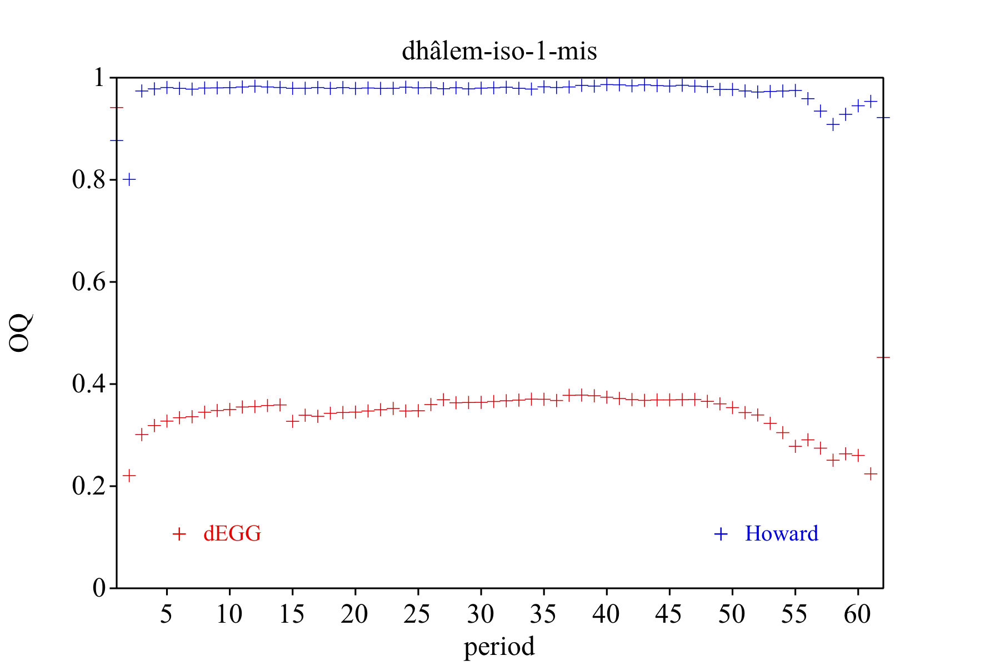

Didn't we already fix this problem? If we inspect the PointProcess object, we see that the problem is the point we removed in [Example 1](#example1) above:

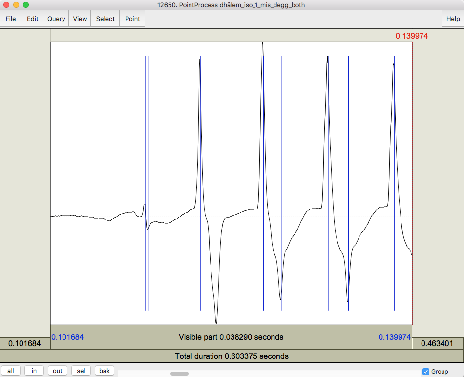

We will need to add this point back in order to correctly calculate Oq for this region. The closer we zoom in, the more accurately we can place our pulsemark:

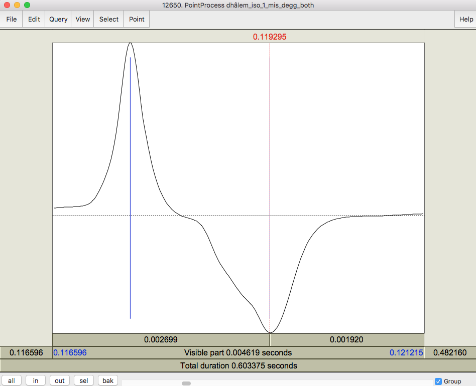

The resulting Oq plot looks much better:

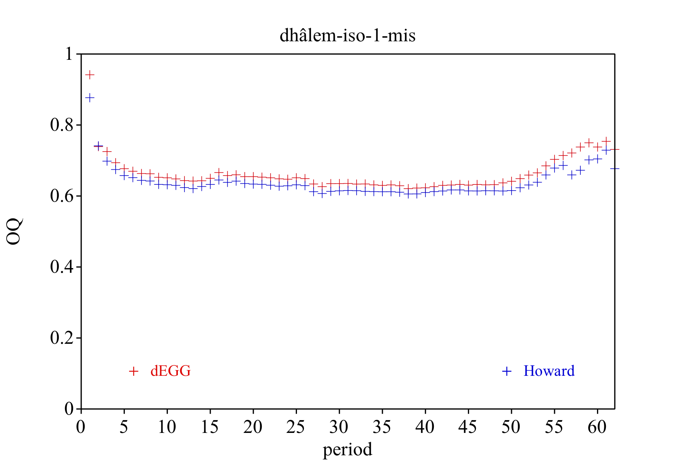

The first (and possibly last) periods look as though they may be spurious, and looking at the previous PointProcess object gives some indication of why. We could simply remove these two points, or we can remove the entire period in the next step:

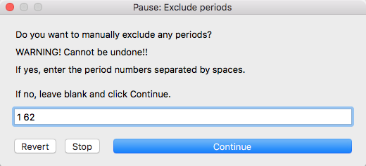

This has the advantage of retaining this period in the output, but setting its value to zero, indicating that it was detected, but removed by the user.


In the next file, we see that Praat has failed to detect an opening peak.

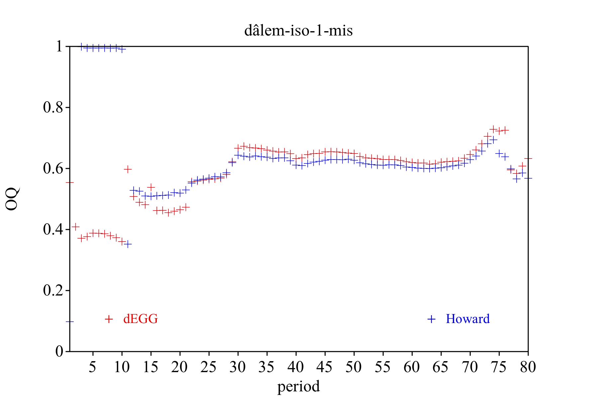

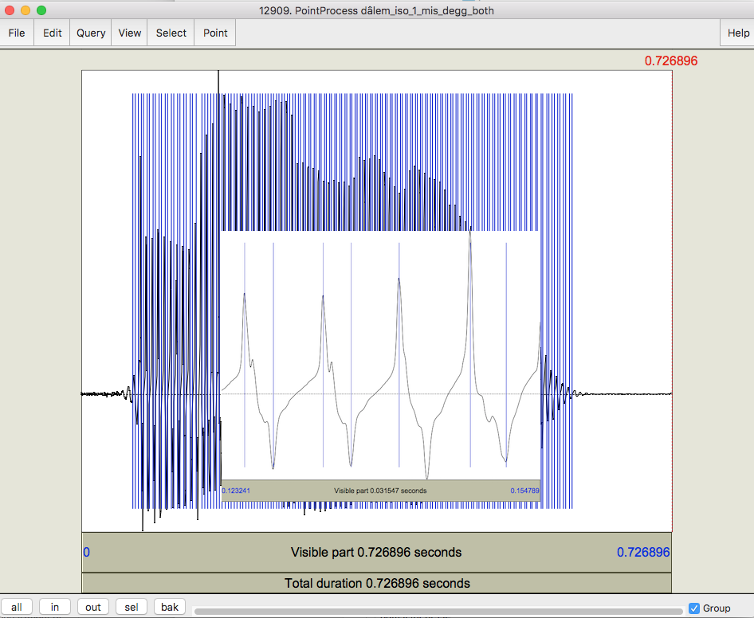

However, simply adding this does not fix the issue; the first peak detected in this file "counts" as an opening peak and must therefore be removed. 

If you scroll along you will see a number of examples of multiple opening and closing peaks in this signal. **praatdet** simply selects the most extreme (positive or negative) peak. As discussed extensively elsewhere, this may not be appropriate, and you may wish to remove periods containing such multiple peaks.
